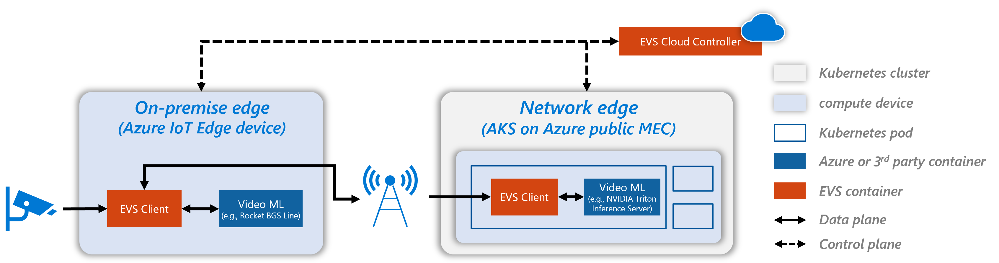
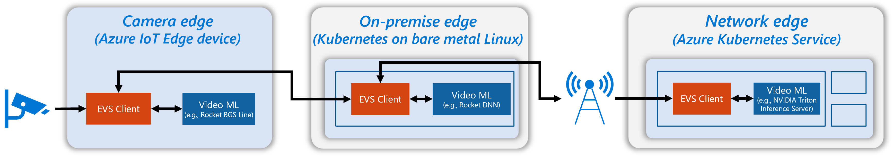

# Edge Video Services

This repository provides a reference architecture of Edge Video Services (EVS). It includes instructions to build and deploy a video analytics service tailored for operator's infrastructure using [Kubernetes](https://kubernetes.io/) in the [Azure public MEC](https://azure.microsoft.com/en-us/solutions/public-multi-access-edge-compute-mec/) and [Azure IoT Edge](https://docs.microsoft.com/en-us/azure/iot-edge/about-iot-edge), and video ML containers like [NVIDIA Triton Inference Server](https://developer.nvidia.com/nvidia-triton-inference-server), [Microsoft Rocket](https://aka.ms/rocket), and [Intel OpenVINO Model Server](https://azuremarketplace.microsoft.com/en-us/marketplace/apps/intel_corporation.ovms). The repository also contains a sample video to count vehicles entering a parking lot for end-to-end testing.

## EVS Architecture

Figure 1 shows the architecture of a video analytics pipeline deployed in an operator's infrastructure. The two-layer edge hierarchy consists of an on-premise (on-prem) edge (an [Azure IoT Edge](https://docs.microsoft.com/en-us/azure/iot-edge/about-iot-edge?view=iotedge-2020-11) device), and a network edge (an [Azure Kubernetes Service](https://docs.microsoft.com/en-us/azure/aks/intro-kubernetes), or AKS on [Azure public MEC](https://azure.microsoft.com/en-us/solutions/public-multi-access-edge-compute-mec/)). 

  - **On-prem edge:** An edge machine which sits on enterprise premise. It could be a customer-owned edge box or a compute cluster consisting of multiple work stations.
  - **Network edge:** A beefy edge (*e.g.,* [Azure public MEC](https://azure.microsoft.com/en-us/solutions/public-multi-access-edge-compute-mec/)) with optimized connectivity to the on-prem edge and the cloud. Typically, it consists of a cluster of machines with accelerators like GPU. 

<i>Figure 1: A sample two-layer edge hierarchy with one on-prem edge node and one network edge cluster.</i>

EVS provides the platform to ingest and orchestrate a [cascaded video pipeline](https://techcommunity.microsoft.com/t5/internet-of-things/live-video-analytics-with-microsoft-rocket-for-reducing-edge) for analytics by splitting the pipeline across the edges. An EVS Client container is running on each edge to supply frames to various video ML containers. This way, EVS partitions the video processing workloads to make the best use of the available compute and network resources in the edge and cloud infrastructure.

> ❗**Note:** *Video ML containers supported by EVS include [Microsoft Rocket](https://aka.ms/rocket), [Intel OpenVINO Model Server](https://azuremarketplace.microsoft.com/en-us/marketplace/apps/intel_corporation.ovms), and [NVIDIA Triton Inference Server](https://developer.nvidia.com/nvidia-triton-inference-server) which already have support to plug in popular models for object detection and classification.*

**Other types of edge hierarchies:** While the example above uses a two-layer edge hierarchy, EVS is generally applicable to all types of edge hierarchies. For instance, a three-layer edge hierarchy could have a camera edge (*e.g.,* a smart camera) sitting together with an on-prem edge (*e.g.,* a Kubernetes cluster on bare metal Linux) in a private 5G network before accessing the public MEC (Figure 2).

<i>Figure 2: A three-layer edge hierarchy with a camera edge, an on-prem edge (cluster), and a network edge.</i>

**Deployment Instructions:** In what follows, we use _two-layer hierarchy_ (Figure 1) as an example, and describe the steps to deploy EVS on an on-prem edge (mimicked by an Azure VM as an IoT Edge Device) and a network edge (an AKS cluster in the public MEC). In the two-layer hierarchy, a CPU-based [Rocket container](https://github.com/microsoft/Microsoft-Rocket-Video-Analytics-Platform) is deployed to the on-prem edge for motion-based object detection. When an objects cross lines of interest in the frame, frames will be encoded and sent to the AKS cluster in the network edge for DNN-based object detection using NVIDIA Triton inference container with COCO pretrained [YOLOv3](https://pjreddie.com/darknet/yolo/). As a result, EVS reduces network traffic between the edges and provides efficient compute usage in public MEC.  

We also provide a [sample mp4 video](https://aka.ms/evs-videosample) along with a [line configuration file](https://aka.ms/linesample) so that you can run the pipeline end-to-end with an example to count vehicles entering a parking lot. You will also be able to test the deployment on your own videos (both pre-recorded ones and live RTSP streams). To learn more about configuring lines of interest, please visit [this page](https://github.com/microsoft/Microsoft-Rocket-Video-Analytics-Platform/blob/master/documents/line_configuration.md). 

## Pre-requisites

### 0. Terminology
Throughout the samples, we refer to two different terms. Here are descriptions for each of them for future reference:

  - **Development PC:** the machine you use to clone the repo, run Jupyter Notebooks, connect to AKS cluster (*e.g.,* via [Azure and Kubernetes CLI](https://docs.microsoft.com/en-us/azure/aks/kubernetes-walkthrough)), and remote login to any of the compute devices and the on-prem Kubernetes control node. We use a Windows 10 desktop in this example.   
  - **Compute Device:** any of the machines run EVS and video analytics containers. That includes the Azure IoT Edge device, and nodes in network edge clusters.

### 1. Setup Development PC
You may use your existing Development System (*e.g.,* your desktop or laptop) _or_ refer below link to create and setup a new Azure Virtual machine.

- (1.1) [Create development PC - Azure virtual machine](https://docs.microsoft.com/en-us/azure/virtual-machines/windows/quick-create-cli#create-virtual-machine) (if you are using your existing Development System, you may skip this step and move to 1.2)

- (1.2) [Configure development PC](./common/setup-development-pc.md)

### 2. Setup Azure IoT Edge on the on-prem edge

- (2.1) [Set up a virtual machine to act as an IoT Edge device](./common/install_iotedge_runtime.md) 

### 3. Create the required Azure Services

- (3.1) [Setting up the environment](./common/setup_environment.ipynb)

- (3.2) [Create Azure services](./common/create_azure_services.ipynb)

### 4. Create an Azure Kubernetes Service (AKS) cluster as network edge cluster

- (4.1) [Setting up an AKS cluster in public MEC or Azure region](./common/create_aks_service.ipynb)

## Deploy and Orchestrate Video Pipeline in a Two-layer Edge Hierarchy

Now let's walk through the steps for deploying and orchestrating a video pipeline across the two-layer edge hierarchy (*i.e.,* IoT Edge Device + AKS in Figure 1). 

### 5. Deploy EVS and Video ML Containers to the Network Edge (AKS)

- [Read and follow the section to learn how to deploy EVS and video ML containers to the network edge.](./common/aks-deployment.md)

### 6. Deploy Edge Modules to the on-prem Edge (IoT Edge Device)

- [Read and follow the section to learn how to deploy edge modules to the on-prem edge.](./common/onpremedge-deployment.md)

### 7. Monitor and Interpret the Output
- (7.1) [Read and follow the section to learn how to monitor and interpret the output.](./common/monitor-output.md)
- (7.2) [Read and follow the section to learn how to reset the IoT edge device.](./common/resetting-the-iot-edge.md)

### 8. EVS Configuration and Cross-Edge Adaptation
- [Read and follow the section to learn how to (re-)configure EVS for cross-edge adaptation.](./common/evs-config.md)

## Tested Specifications 
| Setup | On-premise Edge              | Network Edge Cluster                                 | Testing Status |
|-------|------------------------------|------------------------------------------------------|----------------|
| 1     | Azure VM - OS: Ubuntu 20.04  | Azure Kubernetes Service - VM Size: Standard_NC6s_v2 | Passed         |

## Information links
•   [Azure public MEC](https://docs.microsoft.com/en-us/azure/public-multi-access-edge-compute-mec/overview)  
•   [Microsoft and AT&T demonstrate 5G-powered video analytics](https://azure.microsoft.com/en-us/blog/microsoft-and-att-demonstrate-5gpowered-video-analytics/)  
•   [Video analytics at the edge, an ideal technology for 5G cloud monetization](https://azure.microsoft.com/en-us/blog/video-analytics-at-the-edge-an-ideal-technology-for-5g-cloud-monetization/)  
•   [Telstra creates innovative AI solutions for the 5G era with Azure Video Analyzer](https://customers.microsoft.com/en-us/story/1369471834895808585-telstra-telecommunications-azure-video-analyzer)  
•   [Azure for Operators](https://azure.microsoft.com/en-us/industries/telecommunications/#overview)  

## Contents

| Folders          | Description                                                                              |
|------------------|------------------------------------------------------------------------------------------|
| common           | collection of deployment instructions and Jupyter notebooks for environment setup        |
| templates        | template deployment manifest for on-prem and network edge                                |

## Contributing

This project welcomes contributions and suggestions.  Most contributions require you to agree to a
Contributor License Agreement (CLA) declaring that you have the right to, and actually do, grant us
the rights to use your contribution. For details, visit https://cla.opensource.microsoft.com.

When you submit a pull request, a CLA bot will automatically determine whether you need to provide
a CLA and decorate the PR appropriately (e.g., status check, comment). Simply follow the instructions
provided by the bot. You will only need to do this once across all repos using our CLA.

This project has adopted the [Microsoft Open Source Code of Conduct](https://opensource.microsoft.com/codeofconduct/).
For more information see the [Code of Conduct FAQ](https://opensource.microsoft.com/codeofconduct/faq/) or
contact [opencode@microsoft.com](mailto:opencode@microsoft.com) with any additional questions or comments.

## Trademarks

This project may contain trademarks or logos for projects, products, or services. Authorized use of Microsoft 
trademarks or logos is subject to and must follow 
[Microsoft's Trademark & Brand Guidelines](https://www.microsoft.com/en-us/legal/intellectualproperty/trademarks/usage/general).
Use of Microsoft trademarks or logos in modified versions of this project must not cause confusion or imply Microsoft sponsorship.
Any use of third-party trademarks or logos are subject to those third-party's policies.
