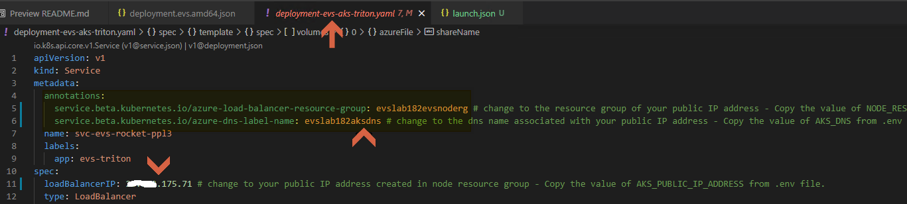
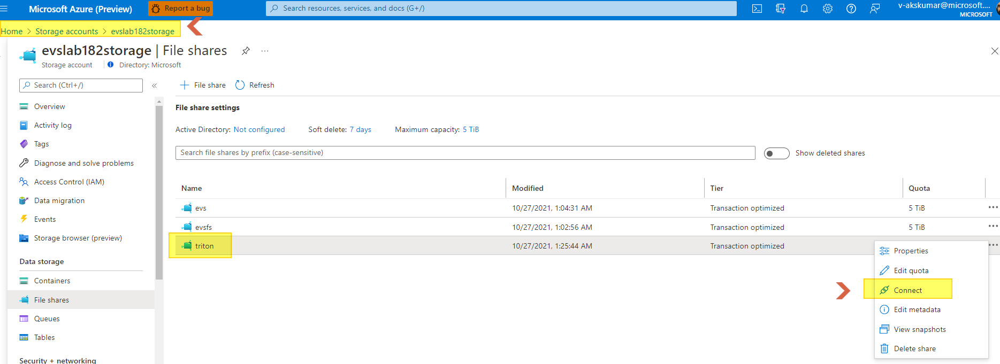
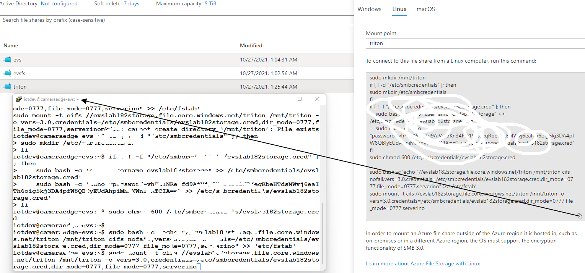
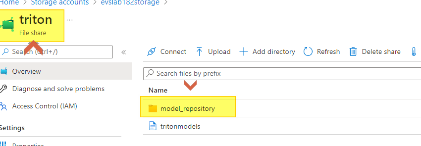
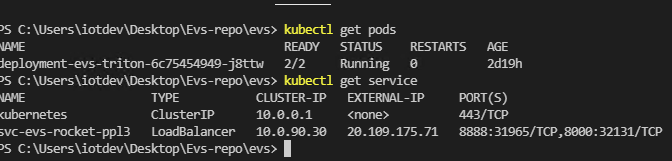
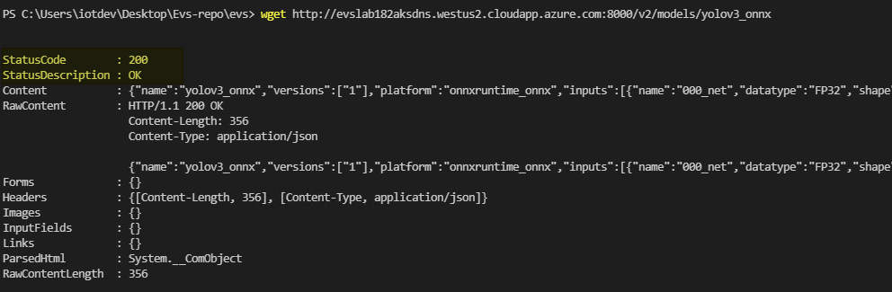

# Deploy EVS and Video ML Containers to the Network Edge (AKS)
In this example, we use NVIDIA Triton Inference Server as video ML container on network edge. To deploy Triton, on your development PC that connects to the AKS cluster 

(5.1) Change `azure-load-balancer-resource-group`, `azure-dns-label-name`, `loadBalancerIP` values in Service in **deployment-evs-aks-triton.yaml** to corresponding values of your Azure public IP address resource.
> ❗**Note:** *Values of these variables can be copied from the .env file.*

 


(5.2) [Download pre-trained DNN models](https://aka.ms/tritonmodels) and upload **model_repository** folder to your Azure File Share created in [Mount Azure File Share on Kubernetes]

## Instructions:

- 5.2.1) Login to the azure portal and go to the storage account created in previous steps and connect the fileshare.

         

- 5.2.2) Copy the Mount command and mount the file share in any of the linux system (We have used camera edge for this)

      

- 5.2.3) Once the fileshare in your system - You can download the triton model in mounted file share and unzip it.

             
             Reference commands :

             cd /mnt/triton
             wget https://aka.ms/tritonmodels
             sudo apt-get install unzip
             unzip triton_models
             
- 5.2.4) Validation - Your file share should have model_repository

      


(5.3) Change all `XX` (*e.g.,* `secretName`, `shareName` of `volumes`) in **deployment-evs-aks-triton.yaml** to corresponding values in your setup from previous steps.
> ❗**Note:** We have already created secrets in step 3.2, please validate the secret names.

(5.4) Run the command below in VS Code to deploy Triton Inference Server container to the AKS cluster.
    ```sh
    kubectl apply -f deployment-evs-aks-triton.yaml
    ```
 ❗**Note:** Wait for 4-5 minutes, for the first run the container may take some time to come up.

(5.5) Validations: 
```
kubectl get pods 
kubectl get services 
Both container and service should be running
```



❗**Note:** In case of any error please check container logs / Describe pod and check for the error & troubleshoot accordingly.

(5.6) Validate the DNS Response:
```
In the same terminal - please run : 
wget http://REPLACE-WITH-YOUR-AKS-DNS.cloudapp.azure.com:8000/v2/models/yolov3_onnx
```
Expected Output:



(5.7) **Optional:** EVS supports the deployment of containers to a particular node in a Kubernetes cluster. For instance, you can deploy a video ML container with a relatively heavy DNN model to VMs with certain GPUs. To do so, you will need to [created labels for different compute nodes](https://kubernetes.io/docs/tasks/configure-pod-container/assign-pods-nodes/), and then update and uncomment `nodeSelector:` section in the yaml file to assign pods to nodes with certain labels. 

### Please return to [README.md](../README.md#5-deploy-evs-and-video-ml-containers-to-the-network-edge-aks) and follow Section 6.1.