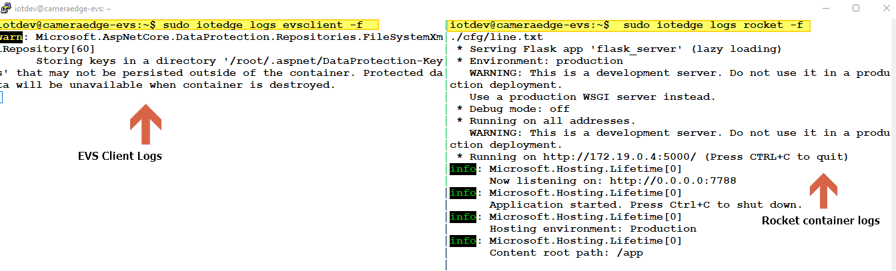
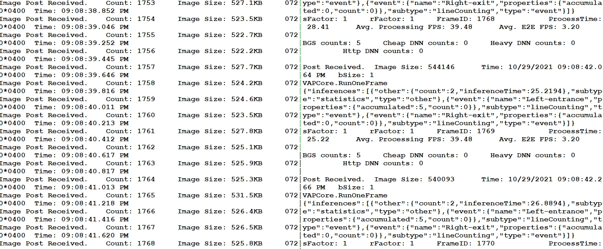
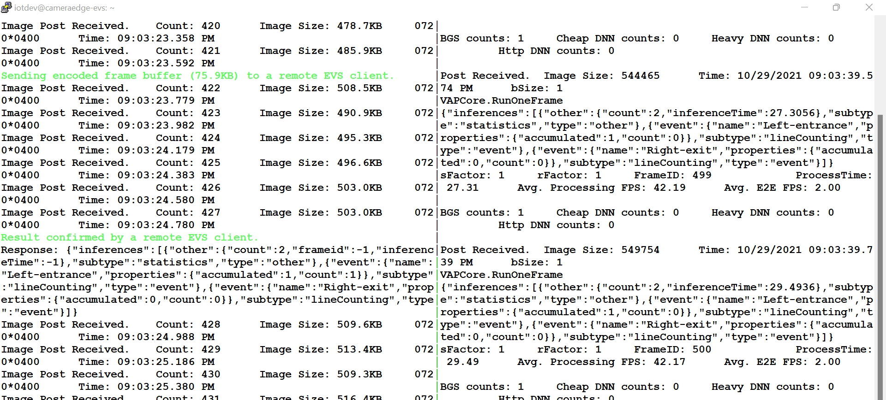
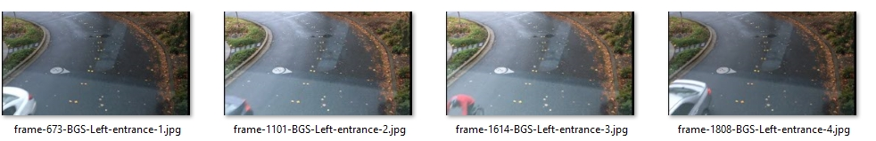
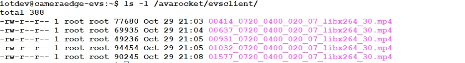
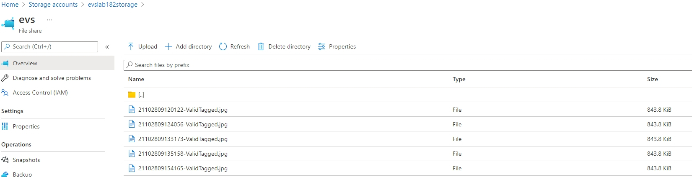
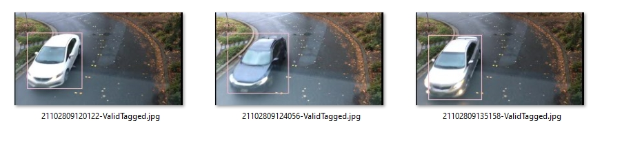

# Output Format & Interpretations 

EVS client ingests video at a pre-specified frameRate defined in the deployment manifest. Counting results from Rocket are serialized as a JSON object, and sent back to EVS client container as response of the corresponding POST request.

### Monitoring EVS Client and Rocket container logs in on the camera edge

1) On your on-prem edge, open two ssh sessions, one for monitoring evs client logs and the other for observing Rocket video ML container logs.
To split screens, you can use an application like tmux.

Print Logs using:
```
sudo iotedge logs rocket -f
sudo iotedge logs evsclient -f
```
 

2) Once deployed, EVS client will start ingesting video and posting frames to Rocket container for Background Detection and Line Occupancy Analysis.

 

### EVS Client Logs: 
```
Image Post Received.    Count: 1752     Image Size: 521.8KB     0720*0400       Time: 09:08:38.644 PM
Image Post Received.    Count: 1753     Image Size: 527.1KB     0720*0400       Time: 09:08:38.852 PM
Image Post Received.    Count: 1754     Image Size: 523.5KB     0720*0400       Time: 09:08:39.046 PM
Image Post Received.    Count: 1755     Image Size: 522.7KB     0720*0400       Time: 09:08:39.252 PM
Image Post Received.    Count: 1756     Image Size: 522.2KB     0720*0400       Time: 09:08:39.445 PM
Image Post Received.    Count: 1757     Image Size: 527.7KB     0720*0400       Time: 09:08:39.646 PM
Image Post Received.    Count: 1758     Image Size: 524.2KB     0720*0400       Time: 09:08:39.816 PM
Image Post Received.    Count: 1759     Image Size: 524.6KB     0720*0400       Time: 09:08:40.011 PM
Image Post Received.    Count: 1760     Image Size: 523.5KB     0720*0400       Time: 09:08:40.213 PM
Image Post Received.    Count: 1761     Image Size: 527.8KB     0720*0400       Time: 09:08:40.412 PM
Image Post Received.    Count: 1762     Image Size: 525.1KB     0720*0400       Time: 09:08:40.617 PM
Image Post Received.    Count: 1763     Image Size: 525.9KB     0720*0400       
```
### Rocket Container Logs : 
```
Post Received.  Image Size: 539165      Time: 10/29/2021 09:08:41.638 PM        bSize: 1
VAPCore.RunOneFrame
{"inferences":[{"other":{"count":2,"inferenceTime":26.2259},"subtype":"statistics","type":"other"},{"event":{"name":"Left-entrance","properties":{"accumulated":5,"count":0}},"subtype":"lineCounting","type":"event"},{"event":{"name":"Right-exit","properties":{"accumulated":0,"count":0}},"subtype":"lineCounting","type":"event"}]}
sFactor: 1     rFactor: 1     FrameID: 1767            ProcessTime: 26.23      Avg. Processing FPS: 39.48      Avg. E2E FPS: 3.20
BGS counts: 5     Cheap DNN counts: 0     Heavy DNN counts: 0               Http DNN counts: 0
```

4. Object detection - As soon as an object is spotted, a frame buffer is encoded as a video clip and sent to the evsclient container on the network edge (*e.g.,* AKS).
The example below shows an object is confirmed by the remote evs client after a heavy DNN operation.
You may examine the remote EVS Client's response by running `kubectl logs <YOUR_EVS_POD_NAME> evs -f` on your network edge cluster.

 

### Sample logs - EVS client
```
** object detected by local AI module.
Image Post Received.    Count: 1578     Image Size: 505.9KB     0720*0400       Time: 09:08:16.082 PM
Image Post Received.    Count: 1579     Image Size: 528.5KB     0720*0400       Time: 09:08:16.170 PM
Image Post Received.    Count: 1580     Image Size: 536.7KB     0720*0400       Time: 09:08:16.290 PM
Image Post Received.    Count: 1581     Image Size: 545.0KB     0720*0400       Time: 09:08:16.368 PM
Image Post Received.    Count: 1582     Image Size: 548.6KB     0720*0400       Time: 09:08:16.479 PM
Image Post Received.    Count: 1583     Image Size: 547.4KB     0720*0400       Time: 09:08:16.575 PM
Image Post Received.    Count: 1584     Image Size: 548.9KB     0720*0400       Time: 09:08:16.704 PM
Image Post Received.    Count: 1585     Image Size: 554.6KB     0720*0400       Time: 09:08:16.815 PM
Image Post Received.    Count: 1586     Image Size: 551.8KB     0720*0400       Time: 09:08:16.941 PM
Sending encoded frame buffer (88.1KB) to a remote EVS client.
Image Post Received.    Count: 1587     Image Size: 551.9KB     0720*0400       Time: 09:08:17.049 PM
Image Post Received.    Count: 1588     Image Size: 538.8KB     0720*0400       Time: 09:08:17.155 PM
Image Post Received.    Count: 1589     Image Size: 538.2KB     0720*0400       Time: 09:08:17.246 PM
Image Post Received.    Count: 1590     Image Size: 539.4KB     0720*0400       Time: 09:08:17.336 PM
Image Post Received.    Count: 1591     Image Size: 544.1KB     0720*0400       Time: 09:08:17.433 PM
Image Post Received.    Count: 1592     Image Size: 543.3KB     0720*0400       Time: 09:08:17.528 PM
Image Post Received.    Count: 1593     Image Size: 543.9KB     0720*0400       Time: 09:08:17.617 PM
Image Post Received.    Count: 1594     Image Size: 544.4KB     0720*0400       Time: 09:08:17.712 PM
Image Post Received.    Count: 1595     Image Size: 549.7KB     0720*0400       Time: 09:08:17.800 PM
Image Post Received.    Count: 1596     Image Size: 550.5KB     0720*0400       Time: 09:08:17.892 PM
Image Post Received.    Count: 1597     Image Size: 550.9KB     0720*0400       Time: 09:08:17.983 PM
Image Post Received.    Count: 1598     Image Size: 553.1KB     0720*0400       Time: 09:08:18.075 PM
Result confirmed by a remote EVS client.
Response: {"inferences":[{"other":{"count":2,"frameid":-1,"inferenceTime":-1},"subtype":"statistics","type":"other"},{"event":{"name":"Left-entrance","properties":{"accumulated":5,"count":1}},"subtype":"lineCounting","type":"event"},{"event":{"name":"Right-exit","properties":{"accumulated":0,"count":0}},"subtype":"lineCounting","type":"event"}]}
```

### Local image output (Background substraction + Line occupency analyser operation)
You can view the output images inside /evsrocket/output_all on the on-prem edge device. Results from different modules are sent to different directories (e.g., output_bgsline for background subtraction-based detector) whereas output_all has images from all modules. 

❗**Note:** /evsrocket/rocket/output_all will list all the frames captured by rocket after background subtraction. 



❗**Note:** /evsrocket/evsclient will list all the buffers which was forwarded by local evs client to remove evs client for DNN Operations




### Network Edge image output (Heavy DNN Operation - YOLOv3)
In the mounted file share that we specified while setting AKS, you can see the output images processed by Network edge after a heavy DNN operation.
Review the images in the evs/output folder/file share in your storage account.



Reference Output:


