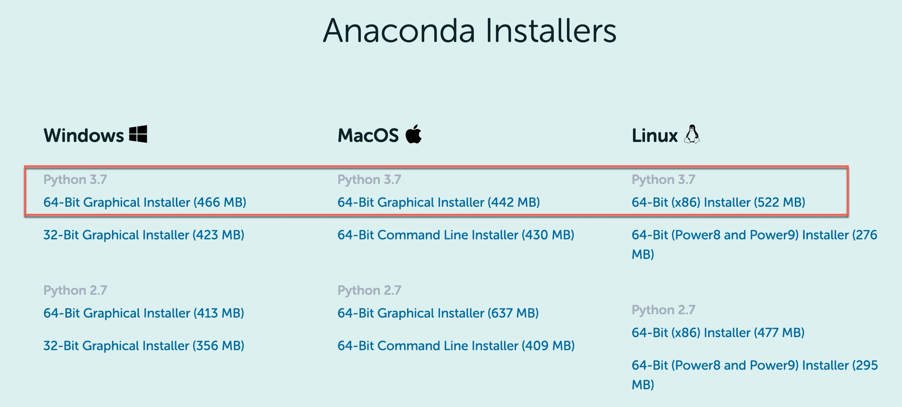
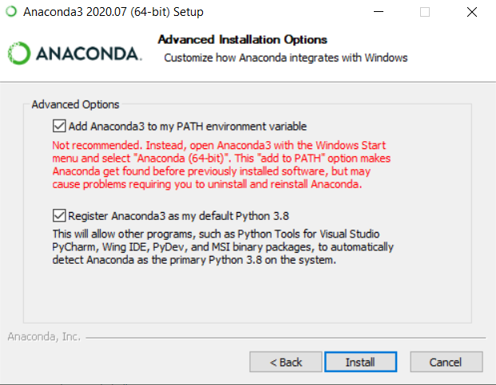
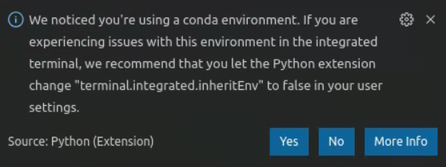
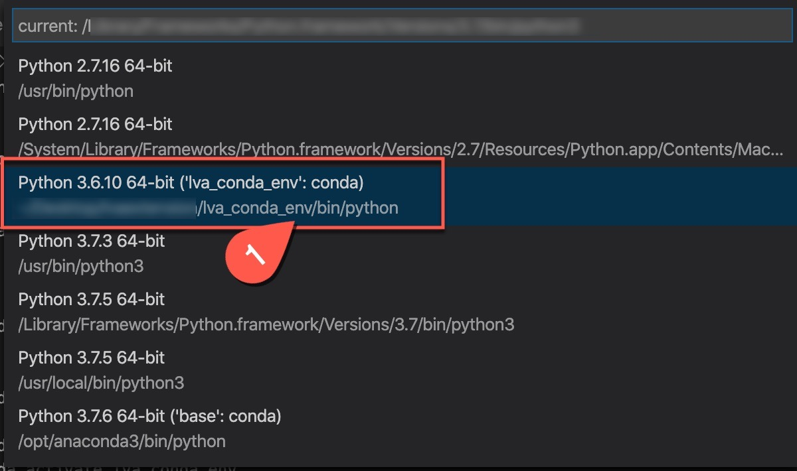
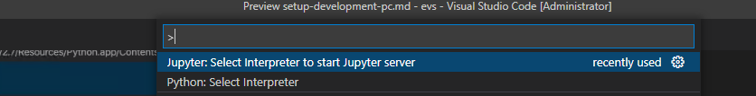
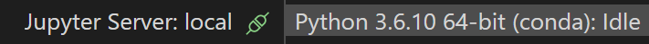
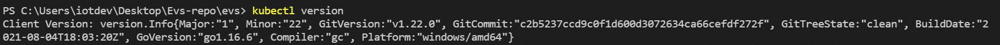

# Setup Development PC
In this section, we will install the required tools to run our lab scenarios. 

## Install the Required Tools

Out of the many options to run, manage, and update Jupyter notebooks, we recommend using Visual Studio Code (VSCode) because it has extensions for running and managing IoT devices as well. Install [Visual Studio Code](https://code.visualstudio.com/docs/setup/setup-overview) , [Git](https://git-scm.com/download/win) and [.NET Core SDK](https://dotnet.microsoft.com/download/dotnet/thank-you/sdk-3.1.414-windows-x64-installer) (This is required in order to execute the .net console programme in the following sections.) if you do not already have it installed. 

1. In Visual Studio Code, install the following extensions:  
    * [Python extension](https://marketplace.visualstudio.com/items?itemName=ms-python.python) 
    * [Azure IoT Tools](https://marketplace.visualstudio.com/items?itemName=vsciot-vscode.azure-iot-tools)
    * [Kubernetes extension](https://marketplace.visualstudio.com/items?itemName=ms-kubernetes-tools.vscode-kubernetes-tools) 
    * [ C# extension](https://marketplace.visualstudio.com/items?itemName=ms-dotnettools.csharp) 


2. To run the Jupyter notebooks, you will need to have [Anaconda](https://www.anaconda.com/products/individual) installed. If you wish to install Anaconda for all users, [read the Anaconda documentation](https://docs.anaconda.com/anaconda/install/multi-user/) for instructions on how to do so.

    
    
    > <span style="color:red; font-weight:bold"> [!IMPORTANT] </span> 
    > <br>When installing Anaconda, select the option that adds Anaconda to your Path, by clicking the checkbox on a graphical installation (Windows and Mac) or by typing 'yes' in the terminal where appropriate (Linux). 
    > <br><br>

### Clone the EVS Repo   
1. [Clone](https://code.visualstudio.com/Docs/editor/versioncontrol#_cloning-a-repository) this [repository](/../../) locally into your development PC and open the repository with VSCode. 
2. Locate this Readme page in your local repository and continue reading the following sections on VSCode. You can preview Markdown (`.md`) pages by pressing `Ctrl+Shift+V` to open a full-screen window or by clicking the preview button on the top toolbar in VSCode. For pictures to render on VSCode, you must have the entire [EVS](/..) folder open in your VSCode workspace. Going forward, we will be using VSCode to run this sample. Please navigate to VSCode to continue. 
   
    
   <br>


## Setting up the conda environment
Once Anaconda is installed, we will be creating a Conda environment to hold all our dependencies for this sample. 

1. Open a terminal window in VSCode.
2. Change the relative terminal path to the following: <b>evs/common</b>.
3. In your terminal, run the following command to install all the necessary packages for this sample, including Jupyter.

    ```
    conda env create --prefix ./evs_conda_env --file environment.yml
    ```

    > <span>[!NOTE]</span>
    > Notice that in this folder, we have a file named [environment.yml](environment.yml), which lists all of our dependencies.

4. Close all tabs and relaunch VSCode.
    * If you get a message that says "To activate this environment..." in your terminal window, you can ignore the message.
    * If you get the following message in VSCode, follow the instructions to turn off the `inheritEnv` setting. You can also turn off the `inheritEnv` setting by going to your VSCode toolbar and clicking File --> Preferences --> Settings. Then, search for `inheritEnv` and uncheck the checkbox.
    
        
  

5. Next, [set the Python environment](https://code.visualstudio.com/docs/python/environments) in VSCode by using the Command Palette (`Ctrl+Shift+P`) and searching for "Python: Select Interpreter" so that the Conda installation of Python is in use.

    

6. Similarly, set the Python environment to start the Jupyter server by using the Command Palette (`Ctrl+Shift+P`) and searching for "Jupyter: Select Interpreter to start Jupyter server".

    

  > <span style="color:red; font-weight:bold"> [!IMPORTANT] </span> 
  > If you are running into issues related to Python package dependencies, you may be using the wrong Python interpreter. You can identify the interpreter on the top right of VSCode, as shown in the image below. The correct Python interpreter should say `Python 3.6.10 64-bit (conda)`. If you do not see this Python interpreter, you can try relaunching VSCode or restarting your development PC.



For additional information about Conda, you can read more about [managing Conda environments](https://docs.conda.io/projects/conda/en/latest/user-guide/tasks/manage-environments.html).

## Install Kubectl
Later in the section we will deploy workloads on Azure Kubernetes Service using Kubectl. As per your development PC Operating system please [Install Kubectl](https://kubernetes.io/docs/tasks/tools/).
> <span style="color:red; font-weight:bold"> [!IMPORTANT] </span> 
  > Download latest release of kubectl and add the binary to your PATH (system variables)

```
Validate the installation by running of kubectl "kubectl version" in your vscode terminal.
```



## Create azure account (Skip if you already have a valid azure subscription)
Because this sample utilizes Azure, you will need an active Azure subscription to run the following sections. If you do not have an active Azure subscription, [create an Azure account](https://azure.microsoft.com/free/?WT.mc_id=A261C142F). 

## Install the azure CLI
To create Azure services, install the Azure Command Line Interface (version >= 2.7.0) based on your development PC's operating system:
* [Linux](https://docs.microsoft.com/en-us/cli/azure/install-azure-cli-apt?view=azure-cli-latest)
* [Windows](https://docs.microsoft.com/en-us/cli/azure/install-azure-cli-windows?view=azure-cli-latest&tabs=azure-cli)
* [MacOS](https://docs.microsoft.com/en-us/cli/azure/install-azure-cli-macos?view=azure-cli-latest)

Remember to use the correct terminal for installing the Azure CLI. Even if you already have the Azure CLI installed, you may want to re-install it.


## Working with jupyter notebooks on VSCode
If you are not familiar with running Jupyter notebooks, we recommend getting started with this tutorial on running [Jupyter on VSCode](https://code.visualstudio.com/docs/python/jupyter-support).

Return to [README page](../README.md). 